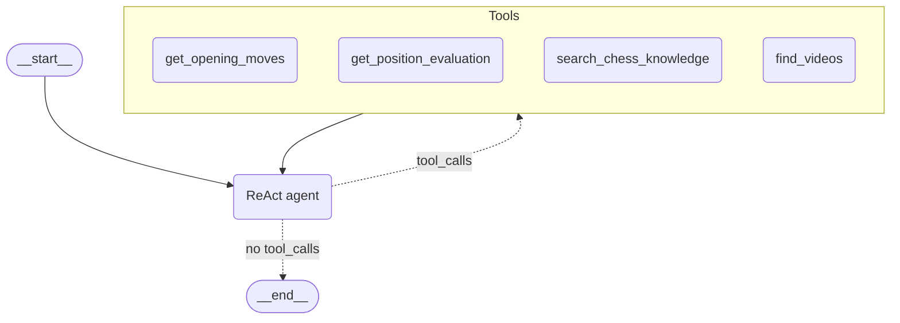

# Agent IA pour la Fédération Française des Échecs

POC d'agent IA conversationnel d'aide à l'apprentissage des ouvertures aux échecs, destiné aux jeunes espoirs de la FFE.

## Stack technique

- **Backend** : Python, FastAPI, LangGraph (agent ReAct), MongoDB
- **Vectorstore** : Milvus
- **Embeddings** : BGE-M3 (BAAI, multilingue FR/EN, dense 1024 dims)
- **Moteur d'analyse** : Stockfish
- **APIs externes** : Lichess Opening Explorer, YouTube Data v3
- **LLM** : Claude Sonnet 4.5 (Anthropic)
- **Frontend** : Angular, chess.js
- **Orchestration** : Docker Compose

## Architecture

Agent ReAct au sens moderne : le LLM choisit lui-même quel(s) tool(s) appeler en fonction de la question utilisateur et de la position d'échecs courante. Aucune logique de routage codée en dur côté Python.



### Tools exposés à l'agent

| Tool | Source | Description |
|------|--------|-------------|
| `get_opening_moves` | Lichess Opening Explorer (base masters) | Statistiques d'ouverture : coups les plus joués, taux de victoire, nom de l'ouverture |
| `get_position_evaluation` | Stockfish (depth 15) | Évaluation objective d'une position : score en centipawns ou mat, meilleur coup, top 5 coups |
| `search_chess_knowledge` | Milvus (RAG sur Wikichess) | Contexte théorique et historique sur les ouvertures |
| `find_videos` | YouTube Data v3 | Recherche de vidéos pédagogiques sur les ouvertures |

### Arbitrage LLM (ReAct niveau 3)

Le LLM orchestre les tools via leurs docstrings, sans `if/else` côté Python :
- Position d'ouverture connue : appelle Lichess pour la théorie des maîtres.
- Position rare ou milieu/fin de partie : appelle Stockfish pour l'évaluation objective.
- Lichess renvoie un résultat vide : le LLM observe et bascule sur Stockfish de lui-même.
- Question sur l'histoire d'une ouverture : appelle le RAG Wikichess.
- Demande de ressource vidéo : appelle YouTube.

## Prérequis

- Docker Desktop 4.x ou supérieur (avec Docker Compose v2)
- Git
- 8 Go de RAM disponibles (Milvus + BGE-M3 sont gourmands)
- Clés API : Anthropic, Lichess, YouTube Data v3

> Stockfish est installé automatiquement dans le conteneur backend via `apt`. Aucune installation locale requise.

## Configuration du fichier .env

Copier `.env.example` en `.env` et renseigner les variables suivantes :

```bash
cp .env.example .env
```

| Variable | Description | Obligatoire |
|----------|-------------|-------------|
| `ANTHROPIC_API_KEY` | Clé API Anthropic (claude.ai/account) | Oui |
| `YOUTUBE_API_KEY` | Clé API YouTube Data v3 (console.cloud.google.com) | Oui |
| `LICHESS_API_KEY` | Token Lichess (lichess.org/account/oauth/token) | Oui |
| `LICHESS_URL` | URL Opening Explorer (défaut : `explorer.lichess.ovh`) | Non |
| `MONGO_URI` | URI MongoDB (défaut : `mongodb://mongo:27017`) | Non |
| `MILVUS_HOST` | Hôte Milvus (défaut : `milvus`) | Non |
| `MILVUS_PORT` | Port Milvus (défaut : `19530`) | Non |
| `STOCKFISH_PATH` | Chemin Stockfish (défaut : `/usr/games/stockfish`) | Non |

## Installation et démarrage

```bash
git clone <repo-url>
cd chess-ai-agent
cp .env.example .env
# Renseigner ANTHROPIC_API_KEY et YOUTUBE_API_KEY dans .env
docker compose up --build
```

Le premier démarrage télécharge le modèle BGE-M3 (~1.5 Go). Compter 5 à 10 minutes selon la connexion. Les démarrages suivants sont rapides (modèle en cache).

L'application sera accessible sur :
- Frontend : http://localhost:4200
- Backend API : http://localhost:8000
- Swagger : http://localhost:8000/docs

### Ingestion de la base de connaissances

À lancer une seule fois après `docker compose up` (idempotent, peut être relancé sans risque) :

```bash
docker compose exec api python -m scripts.ingest_wikichess
```

### Démarrage sans rebuild

Pour les lancements suivants (code inchangé) :

```bash
docker compose up -d
```

Pour tout arrêter sans supprimer les données :

```bash
docker compose down
```

Pour repartir d'une installation fraîche (supprime les volumes) :

```bash
docker compose down -v
docker compose up --build
```

## Structure du projet

```
├── backend/
│   ├── api/
│   │   └── main.py               # Point d'entrée FastAPI
│   ├── app/
│   │   ├── agent/                # Graph LangGraph + call_agent()
│   │   ├── api/
│   │   │   └── v1/
│   │   │       └── routers/      # agent_router.py, chess_router.py
│   │   ├── rag/                  # Pipeline RAG Milvus
│   │   │   ├── milvus_client.py  # Connexion pymilvus + collection HNSW cosine
│   │   │   ├── embedder.py       # BGE-M3 multilingue, encodage dense 1024 dims
│   │   │   ├── rag_service.py    # search_knowledge() : recherche vectorielle
│   │   │   ├── chunker.py        # RecursiveCharacterTextSplitter + extraction YAML
│   │   │   └── knowledge/        # 10 articles Wikichess (.md, versionnés)
│   │   ├── schemas/              # Modèles Pydantic (chess.py, lichess.py, stockfish.py)
│   │   ├── services/             # Logique métier (lichess, stockfish, mongo)
│   │   └── tools/                # Wrappers @tool LangGraph
│   ├── scripts/
│   │   └── ingest_wikichess.py   # Ingestion idempotente knowledge/ -> Milvus
│   └── tests/                    # Tests d'intégration pytest
├── frontend/                     # Application Angular (échiquier chess.js, AgentService, connexion agent)
├── docs/                         # Documentation et note MCP
├── prompts/                      # System prompt agent
├── docker-compose.yml
├── .env.example
└── README.md
```

## Troubleshooting

**Le frontend ne démarre pas (`dependency failed to start`)**
Le frontend attend que l'API soit `healthy`. L'API attend le chargement du modèle BGE-M3 au premier démarrage (5 à 10 min). Patienter jusqu'à voir `fastapi-application Healthy` dans la sortie de `docker compose up`.

**`docker compose ps` montre `api` en `unhealthy` après 10 minutes**
Vérifier les logs : `docker logs fastapi-application --tail=50`. Cause probable : variable d'environnement manquante dans `.env` (notamment `ANTHROPIC_API_KEY`).

**Port 8000 ou 4200 déjà utilisé**
Arrêter le processus occupant le port ou modifier les ports dans `docker-compose.yml` (`"8001:8000"` par exemple).

**Milvus ne démarre pas (`etcd` ou `minio` unhealthy)**
Ces services sont lents sur certaines machines. Augmenter le `start_period` dans le `docker-compose.yml` ou relancer avec `docker compose up -d` (les services déjà healthy ne redémarrent pas).

**Réinitialiser complètement**
```bash
docker compose down -v
docker system prune -f
docker compose up --build
```

## Avancement

- [x] Étape 1 : Environnement (repo, Docker Compose, FastAPI hello world)
- [x] Étape 2a : Tool Lichess (service + schemas Pydantic + tool LangGraph)
- [x] Étape 2b : Tool Stockfish (service + schemas Pydantic + tool LangGraph)
- [x] Jalon tool calling validé (agent 1 tool, puis agent 2 tools)
- [x] Étape 2c : System prompt soigné + gestion erreurs/timeouts + validation FEN + boucle ReAct bornée
- [x] Étape 2d : Endpoints FastAPI + logging MongoDB + tests d'intégration
- [x] Étape 3a : Infra Milvus (docker-compose etcd + MinIO + Milvus standalone, connexion pymilvus)
- [x] Étape 3b : Données Wikichess (10 articles curatés, chunker RecursiveCharacterTextSplitter, métadonnées ECO/ouverture)
- [x] Étape 3c : Embeddings BGE-M3 + collection HNSW cosine + ingestion idempotente + tool search_chess_knowledge + agent 3 tools
- [x] Étape 4 : Tool YouTube + agent 4 tools
- [x] Étape 5 : Frontend Angular (échiquier, synchro FEN, panel recommandations, états chargement/erreur)
- [x] Étape 6 : Packaging Docker Compose final (healthchecks, depends_on conditionnel, volumes persistants)
- [x] Étape 7 : Étude de faisabilité MCP (bénéfices/limites, schéma d'architecture, chiffrage build/opex, alternatives, roadmap, note exportée en PDF dans `docs/`)

## Auteur

Jonathan Fernandez, formation AI Engineer OpenClassrooms.