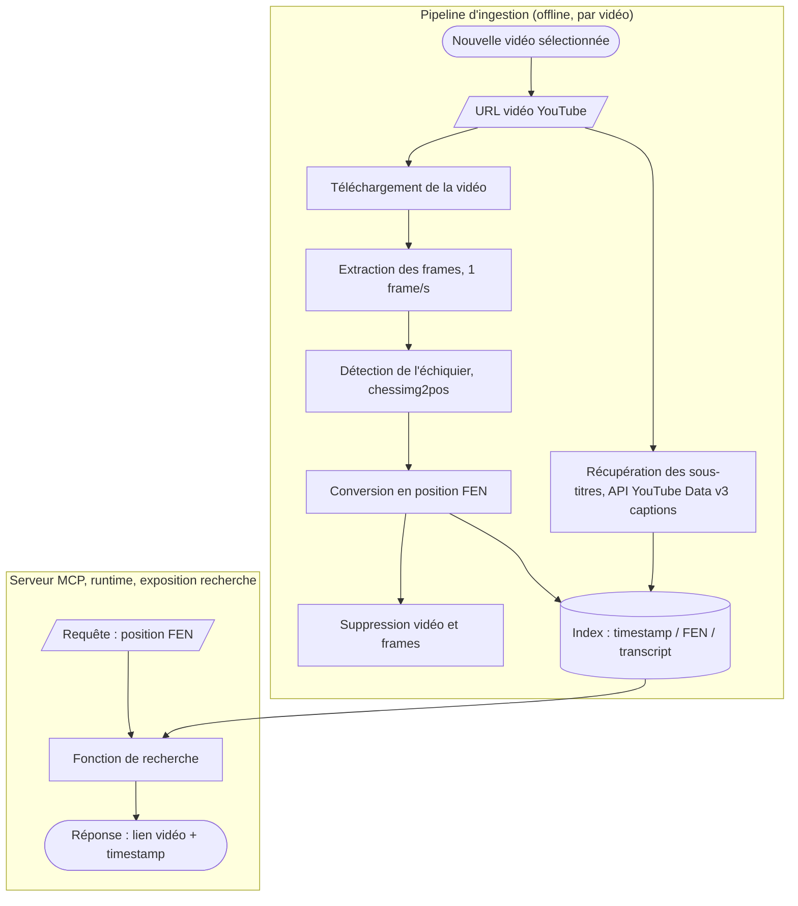

# Note MCP : système d'analyse vidéo board-to-FEN

## Bénéfices et limites

### Périmètre du système

Le système étudié est un serveur MCP dédié à l'analyse vidéo : stockage de vidéos pédagogiques d'échecs, extraction de frames, détection d'échiquier et conversion en notation FEN via un modèle de vision, puis recherche d'une position exacte dans le catalogue avec retour du lien et du timestamp précis. Ce système est distinct de l'agent ReAct existant (Lichess, Stockfish, RAG, YouTube), qui reste hors de ce périmètre.

### Architecture technique

Le système se découpe en deux flux distincts : un pipeline d'ingestion exécuté une fois par vidéo (coût ponctuel, hors ligne), et un serveur MCP exposant une fonction de recherche sur l'index déjà construit (coût récurrent négligeable, en ligne). Cette séparation correspond directement à la distinction build/opex détaillée dans l'étude de faisabilité plus bas dans la note.

La récupération des sous-titres part directement de l'URL vidéo, sans dépendre du téléchargement du fichier : l'API YouTube Data v3 fournit les captions à partir du seul identifiant de la vidéo. La vidéo brute et les frames extraites sont supprimées une fois la position FEN obtenue, seul l'index léger (timestamp, FEN, transcript) est conservé durablement. Le serveur MCP n'intervient qu'au moment de la recherche, il interroge l'index déjà construit et ne déclenche aucun nouveau traitement vidéo.

### Bénéfices attendus

**Une base de connaissance ancrée dans la pratique réelle.** Contrairement au RAG actuel, qui s'appuie sur des articles théoriques, ce système capture des positions issues de vraies parties commentées, avec la logique du formateur expliquant pourquoi telle variante est choisie plutôt qu'une autre. Ce niveau d'explication contextuelle dépasse ce que les statistiques Lichess (taux de victoire, fréquence) peuvent fournir.

**Une progression pédagogique pas à pas.** Les tutoriels vidéo suivent généralement une logique d'enseignement (introduction de l'ouverture, variantes principales, pièges courants), ce qui correspond bien à la cible FFE : des jeunes joueurs en phase d'apprentissage, plutôt qu'une base de données brute de coups.

**Une couverture qualitative forte sur les ouvertures populaires.** Les ouvertures les plus enseignées (Italienne, Ruy Lopez, Sicilienne) bénéficient d'un volume important de contenu pédagogique de qualité, ce qui rend le système particulièrement solide sur le socle dont un jeune joueur a le plus besoin.

**Une fonctionnalité différenciante pour la FFE.** Pouvoir renvoyer la vidéo et le moment exact où un maître explique une position donnée est un service que ni Lichess ni un RAG textuel ne proposent.

### Limites techniques

**Couverture partielle par vidéo.** Une vidéo donnée ne couvre généralement qu'une ligne de jeu parmi les variantes possibles d'une ouverture. Le système hérite du biais de couverture du formateur, sans offrir de vue exhaustive de l'arbre d'ouverture.

**Déséquilibre de couverture entre ouvertures.** Les ouvertures populaires, accessibles ou à la mode disposent d'un volume de contenu disponible largement supérieur aux ouvertures techniques ou peu enseignées. Le catalogue final reflète ce biais d'offre vidéo plutôt qu'une couverture théorique équilibrée.

**Dépendance critique au type d'échiquier source.** Ce point structure directement l'architecture technique, avec deux familles de cas appelant des solutions disjointes :
- *Échiquier numérique* (capture d'écran chess.com, Lichess) : détection quasi déterministe, des outils comme chessimg2pos exploitent la régularité du rendu numérique (assets graphiques fixes, absence de perspective, éclairage constant).
- *Échiquier physique filmé en 3D* : nécessite des modèles de vision plus lourds (chesscog, fenify-3D), avec des contraintes fortes sur l'angle de prise de vue, le type de pièces, les ombres portées des pièces du fond masquant celles de devant, et la qualité variable de l'éclairage en vidéo amateur.

Le choix du périmètre source, contenu numérique uniquement ou extension au contenu physique filmé, doit être tranché en amont : il change le budget de développement d'un ordre de grandeur.

**Volume de données nécessaire pour une couverture utile.** Une couverture pertinente du catalogue exige l'ingestion d'un nombre conséquent de vidéos par ouverture, avec un travail de dédoublonnage pour éviter d'indexer plusieurs vidéos couvrant exactement la même ligne sans valeur ajoutée différenciante.

**Robustesse de la détection.** Un taux d'erreur sur la conversion frame vers FEN (pièce mal détectée, mauvaise orientation de l'échiquier) pollue le catalogue avec de fausses correspondances de position, ce qui dégrade la confiance dans l'ensemble du système si le taux d'erreur n'est pas maîtrisé.

### Limites business

**Coût de traitement concentré en amont, pas en continu.** L'architecture pipeline limite les coûts récurrents : téléchargement de la vidéo, extraction des frames, détection et conversion FEN, écriture d'un fichier d'index léger associant chaque timestamp à une position (sur le modèle d'un fichier de sous-titres), puis suppression de la vidéo brute. Le stockage long terme ne porte que sur l'index, la vidéo restant streamée depuis YouTube via lien direct au timestamp.

**Coût de mise à jour du catalogue.** Chaque nouvelle vidéo à ingérer répète le pipeline complet (téléchargement, extraction, détection). C'est un coût récurrent à chaque enrichissement du catalogue, non un coût ponctuel.

**Dépendance à la disponibilité des vidéos sources.** Le système pointe vers des vidéos YouTube tierces. Une vidéo supprimée ou rendue privée invalide le lien retourné par le système, sans action corrective possible côté FFE.

**Risque d'adoption lié à la qualité perçue.** Une détection FEN comportant des erreurs visibles par l'utilisateur dégrade rapidement la confiance dans l'outil, plus rapidement qu'avec un outil purement textuel où l'erreur est moins immédiatement vérifiable par l'utilisateur final.

### Évolution possible : format de sortie augmenté par la transcription

L'index de sortie envisagé initialement associe chaque timestamp à une position FEN, sur le modèle d'un fichier de sous-titres. Une limite de ce format simple apparaît sur les vidéos où le formateur explore une variante secondaire puis revient à sa ligne principale : deux timestamps peuvent partager la même position FEN tout en ayant un rôle pédagogique différent, sans que l'index seul permette de les distinguer.

L'ajout de la transcription au format de sortie répond à ce point. Le triplet devient timestamp, position FEN, texte transcrit. YouTube expose les sous-titres automatiques via l'API Data v3 (endpoint captions), déjà mobilisée par ailleurs dans le projet pour la recherche de vidéos. La récupération de la transcription ne nécessite donc pas de pipeline de transcription audio dédié (type Whisper), elle s'obtient directement depuis l'API au même titre que les métadonnées de la vidéo.

Ce format augmenté ouvre une capacité de recherche hybride : non seulement retrouver une position FEN précise, mais aussi retrouver le moment où un concept donné est évoqué à l'oral, en recherchant sur le texte transcrit. Cette extension rapproche le sous-système d'un mini-RAG vidéo, et reste positionnée comme une évolution du format plutôt qu'un prérequis du MVP de l'étude.

## Étude de faisabilité : chiffrage build et opex

### Périmètre retenu pour le MVP

Le chiffrage ci-dessous porte sur une version 1 volontairement restreinte : traitement exclusif d'échiquiers numériques (captures d'écran type chess.com ou Lichess), à l'exclusion des échiquiers physiques filmés en 3D. Ce choix est cohérent avec le contenu réellement disponible, la grande majorité des tutoriels d'ouverture étant tournés sur ce type d'interface, où la zone d'échiquier occupe une portion large et facilement détectable de l'image malgré la présence éventuelle d'un visage ou de texte sur les côtés. La détection 2D s'appuie sur des outils existants (chessimg2pos) sans nécessiter de fine-tuning dans cette première version.

Hypothèses de volume retenues : un lot initial de 100 vidéos, en français ou en anglais (la traduction étant gérée nativement par le LLM en aval, sans traitement spécifique), d'une durée moyenne de 10 à 40 minutes, avec une extraction à raison d'une frame par seconde.

### Coût de build

**Temps de développement du pipeline.** L'estimation porte sur la construction des modules suivants : téléchargement vidéo, extraction de frames, intégration du modèle de détection existant, génération du fichier d'index timestamp/FEN, et exposition de la fonction de recherche via un serveur MCP (FastMCP). Une fourchette de 8 à 12 jours-homme est retenue, en s'appuyant sur des briques open source existantes plutôt qu'un développement from scratch :

| Module                                                     | Estimation      |
|------------------------------------------------------------|-----------------|
| Pipeline d'ingestion (téléchargement, extraction frames)   | 1,5 à 2 jours   |
| Intégration modèle de détection 2D existant (chessimg2pos) | 2 à 3 jours     |
| Génération et stockage de l'index timestamp/FEN            | 1 à 1,5 jour    |
| Serveur MCP et fonction de recherche                       | 2 à 3 jours     |
| Tests et calibration sur le lot de 100 vidéos              | 1,5 à 2,5 jours |

**Coût de calcul pour le traitement initial du lot de 100 vidéos.** Avec une durée moyenne de 25 minutes par vidéo et une extraction à 1 frame/seconde, le lot représente environ 150 000 frames à traiter. Sur la base de temps d'inférence publiés pour ce type de modèle léger sur GPU d'entrée de gamme (de l'ordre de 0,2 à 1 seconde par frame), le traitement complet représente entre 10 et 40 heures de calcul GPU. Au tarif de 0,40 $/h retenu (cohérent avec les offres T4 sur le marché, qui s'échelonnent globalement de 0,35 à 0,95 $/h en facturation à la demande), le coût de calcul du lot initial se situe entre 4 et 16 dollars, un montant marginal au regard du temps de développement.

### Coût opex (fonctionnement récurrent)

**Traitement de nouvelles vidéos.** Chaque ajout au catalogue répète le pipeline complet. Pour une vidéo de 25 minutes, le coût de calcul unitaire reste de l'ordre de quelques centimes (0,04 à 0,16 $ par vidéo selon la fourchette d'inférence retenue), donc négligeable rapporté à l'unité, mais à multiplier par le rythme d'enrichissement souhaité du catalogue.

**Hébergement du serveur MCP.** Un service léger (exposition d'une fonction de recherche sur un index déjà calculé) ne nécessite pas de GPU en fonctionnement courant, seulement une instance standard pour héberger l'API et l'index. Fourchette indicative : 10 à 30 dollars par mois sur une offre cloud standard, hors pics de traitement de nouvelles vidéos.

**Stockage de l'index.** Le choix de ne conserver que l'index léger (timestamp, FEN, et éventuellement transcription) plutôt que les vidéos elles-mêmes limite fortement ce poste. Pour 100 vidéos, l'index représente un volume de quelques dizaines de mégaoctets seulement, un coût de stockage négligeable (de l'ordre de quelques dollars par mois au tarif cloud standard).

**Appels API YouTube Data v3.** Déjà mobilisée par l'agent ReAct existant pour la recherche de vidéos, son usage s'étend ici à la récupération des métadonnées et des sous-titres automatiques. Le coût reste dans le quota gratuit standard pour ce volume de 100 vidéos, sauf montée en charge significative du catalogue.

### Synthèse des ordres de grandeur

| Poste                                              | Type            | Fourchette                           |
|----------------------------------------------------|-----------------|--------------------------------------|
| Développement du pipeline                          | Build, ponctuel | 8 à 12 jours-homme                   |
| Calcul GPU, traitement du lot initial (100 vidéos) | Build, ponctuel | 4 à 16 $                             |
| Calcul GPU, traitement par nouvelle vidéo          | Opex, récurrent | 0,04 à 0,16 $ par vidéo              |
| Hébergement serveur MCP                            | Opex, récurrent | 10 à 30 $ par mois                   |
| Stockage de l'index                                | Opex, récurrent | Quelques dollars par mois            |
| Appels API YouTube                                 | Opex, récurrent | Dans le quota gratuit pour ce volume |

Le poste dominant du build est le temps de développement, pas le coût de calcul, ce dernier restant marginal grâce au choix d'un modèle de vision existant sans fine-tuning et d'un périmètre 2D. Cette répartition justifie a posteriori la décision de ne pas couvrir les échiquiers physiques filmés dans cette première version, le coût de développement d'un second pipeline de vision 3D representant un effort comparable ou supérieur au pipeline 2D pour une couverture de contenu plus restreinte.

## Alternatives envisagées

**Détection par API tierce payante plutôt que modèle open source intégré.** Des services cloud clé en main pour la détection d'échiquier existent et offriraient probablement une robustesse supérieure d'emblée, sans effort d'intégration. Le choix d'un modèle open source (chessimg2pos) intégré en interne a été préféré pour maîtriser le coût récurrent à grande échelle : un service payant facture à l'usage et ce coût croît avec le volume de vidéos traitées, alors qu'un développement interne reste à un coût marginal une fois l'intégration faite. Cette alternative resterait pertinente si la précision du modèle open source se révélait insuffisante en pratique.

**Intégration comme outil de l'agent existant plutôt que serveur MCP séparé.** L'index pourrait être consulté comme une source supplémentaire par l'agent ReAct, au même titre que le RAG Milvus, sans passer par un serveur dédié. Le choix d'un serveur MCP séparé a été retenu pour isoler le cycle de vie propre à ce sous-système (traitement vidéo asynchrone, mise à jour indépendante du reste de l'agent) et pour explorer cette brique d'architecture dans le cadre de la valeur ajoutée du projet. Un agent ultérieur pourrait néanmoins consommer cet index directement en tool si la séparation MCP n'apporte pas de bénéfice opérationnel suffisant en pratique.

## Roadmap

1. **Pipeline d'ingestion et index.** Construire la chaîne complète (téléchargement, extraction de frames, détection, conversion FEN) et formaliser le format d'index. La récupération de la transcription est intégrée dès cette première itération : son coût d'ajout est négligeable face au gain de désambiguïsation qu'elle apporte.
2. **Serveur MCP minimal.** Exposer la fonction de recherche : requête sur une position FEN, interrogation de l'index, retour du lien vidéo au timestamp exact.
3. **Montée en volume du catalogue.** Cadrer la liste des ouvertures cibles et ingérer par lots successifs pour réduire le déséquilibre de couverture identifié plus haut.
4. **Recherche hybride texte et FEN.** Exploiter la transcription déjà indexée pour retrouver un concept évoqué à l'oral, pas seulement une position exacte.
5. **Extension à la détection 3D.** Couvrir les échiquiers physiques filmés, pour accéder à des ouvertures plus de niche peu représentées en contenu numérique.
6. **Fine-tuning du modèle de détection.** Une fois un volume suffisant de données réelles collecté via les étapes précédentes, affiner la précision au-delà de ce que permet le modèle existant utilisé tel quel.